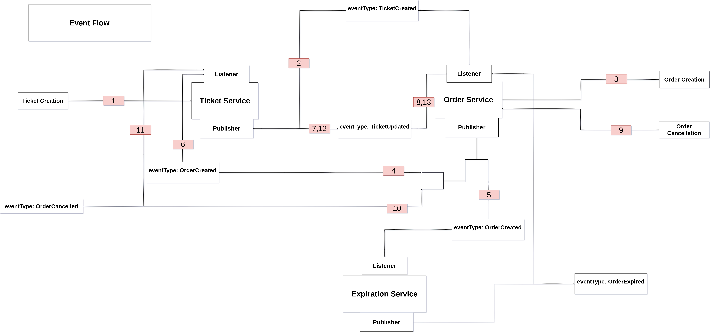

# This is a microservice implementation of ticketing application

## Note: The whole workflow is in [TypeScript](https://www.typescriptlang.org/)

## This documentation includes

- [Requirements](#requirements)
- [Getting Started](#getting-started)
- [API](#api)
- [Features](#features)
- [Event-Flow Diagram](#event-flow)
- [Pending Work](#pending-work)

### Requirements

- [Skaffold](https://skaffold.dev/)
- [Kubectl, Minikube](https://kubernetes.io/docs/tasks/tools/)
- [Docker](https://docs.docker.com/engine/install/)

### Getting Started

**For Development**

```shell

git clone https://github.com/TikZSZ/microservices-ticket-app.git

cd ./microservices-ticket-app

# Make sure minikube is running to start minikube
minikube start

skaffold dev

```

To access the ingress-nginx we need to set minikube ip in hosts because its configured to have a hostName of ticketing.dev
On Linux

```shell
sudo echo "$(minikube ip)  ticketing.dev" >> /etc/hosts
```

and now all routes are available to access.

**For Production**
 infra/k8s includes all configuration that can be used on cloud

### API
**Note: ticketing.dev is assumed to be set in /etc/hosts as minikube ip read [getting started](#getting-started) to set it up**

- https://ticketing.dev/ -> frontend App
- https://ticketing.dev/api/users -> auth service
- https://ticketing.dev/api/tickets -> tickets service
- https://ticketing.dev/api/orders -> orders service
- https://ticketing.dev/api/payments -> payments service

### Features

- #### [Async communication](https://docs.microsoft.com/en-us/dotnet/architecture/microservices/architect-microservice-container-applications/communication-in-microservice-architecture) no inter service dependence and [JWT](https://jwt.io/) as auth mechanism

- #### Events driven architecture using [Nats-Streaming](https://docs.nats.io/nats-streaming-concepts/intro#:~:text=NATS%20Streaming%20is%20a%20data,in%20the%20Go%20programming%20language.&text=NATS%20Streaming%20embeds%2C%20extends%2C%20and,under%20the%20Apache%2D2.0%20license.) with atleast once guarantee

- #### Kubernetes workflow with [skaffold](https://skaffold.dev/) to make development easy. ``All k8s configuration is in infra/k8s``

- #### [MongoDB](https://www.mongodb.com/cloud/atlas/lp/try2-in?utm_source=google&utm_campaign=gs_apac_india_search_core_brand_atlas_desktop&utm_term=mongodb&utm_medium=cpc_paid_search&utm_ad=e&utm_ad_campaign_id=12212624347&gclid=Cj0KCQjwvaeJBhCvARIsABgTDM6qTdIi9fptvD_Yuy9uygNGkwWArBy2jIzubr_CGvTufxGWcW9nFkkaAktvEALw_wcB) as database with database for each resource and [optimistic concurrency control](https://en.wikipedia.org/wiki/Optimistic_concurrency_control) and Versioning for concurrency issues with some nitty-gritty features of mongoose

- #### Redis and BullJS to deal with expiration job of orders

- #### Isolated test cases for each service covering every aspect of service like database model, event flow and api routes

- #### Good practices and highly decoupled and modular implementation of services

- #### Common library for code-reuse

- #### Language independent app flow for most part

- #### Server-Side-Rendering with NextJS which also covers proxy-ing requests to backend `(which is rather complex when using getInitialProps which is called on frontend and serverless functions depending upon state)`

- #### Summary of nitty-gritty details included per service basis as markdown in `Summary` Folder

### Event-Flow



### Pending Work

#### 1 Payment service is not yet complete
#### 2 ci/cd workflow has not been set on the repo
